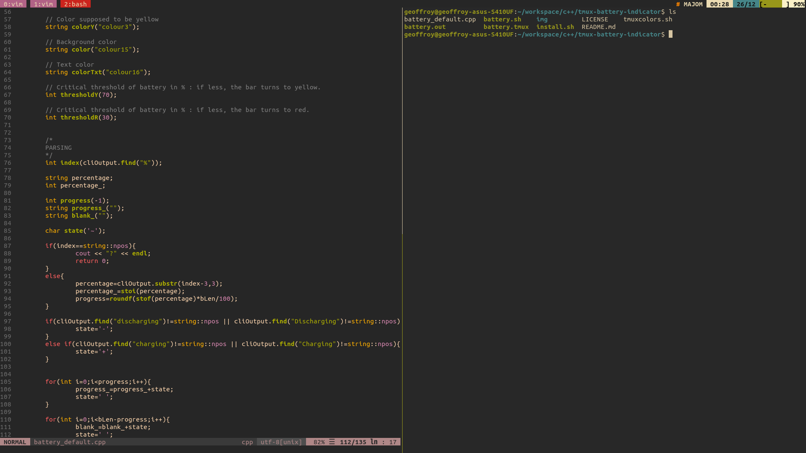

# tmux-battery-indicator
An alternative to the official tmux-battery plugin, written mostly in C++ with a nice battery indicator, easy to customize.  
 

### Compatibility
It works well with two power management tools :  
	- upower (by default) 
	- acpi (see "Use acpi" section) 
Check if these softwares are available in your terminal.

### Screenshots
 
High but discharging (- means discharging)   
 
Low but charging (+ means charging)   
 

### An example in tmux
 

### Installation

Go to ~/.tmux/plugins/ or create the directories if they do not yet exist.

	cd ~/.tmux/plugins/

Clone the repository :

	git clone https://github.com/geoffroymontane/tmux-battery-indicator.git

Note : if you want to change the path, you just have to update battery.sh and battery.tmux with the new value of "path" variable.

Execute install.sh (you need g++ to compile the software):
	
	cd tmux-battery-indicator
	chmod +x install.sh
	sudo ./install.sh

If ~/.tmux.conf does not exist, create it. You have to add the following line at the bottom of this file :

	run-shell 'bash ~/.tmux/plugins/tmux-battery-indicator/battery.tmux'

Then, you just have to add #{battery} to you status bar. For instance, you can add to your .tmux.conf :

	set -g status-right 'Datetime : %H:%M %d/%m Battery : #{battery}'

or just : 

	set -g status-right '#{battery}'

Then, exit tmux an restart it :
	
	tmux kill-server
	tmux

### Use acpi instead of upower

In order to use acpi instead of upower, take a look to battery.sh and edit it. All is explained.

### How to customize it

In order to customize this plugin, edit battery\_default.cpp and recompile by executing install.sh again.

### LICENCE

Copyright (C) 2018/2019 Geoffroy Montané

This program is free software: you can redistribute it and/or modify it under the terms of the GNU General Public License as published by the Free Software Foundation, either version 3 of the License, or
(at your option) any later version.

This program is distributed in the hope that it will be useful, but WITHOUT ANY WARRANTY; without even the implied warranty of MERCHANTABILITY or FITNESS FOR A PARTICULAR PURPOSE. See the
GNU General Public License for more details.

You should have received a copy of the GNU General Public License along with this program.  If not, see <http://www.gnu.org/licenses/>.

